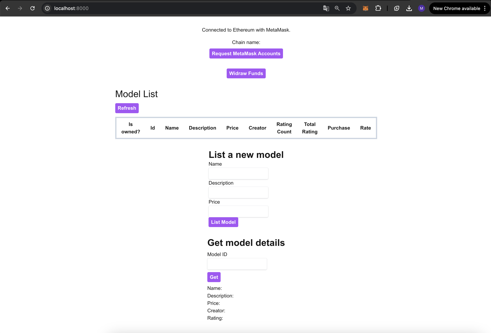
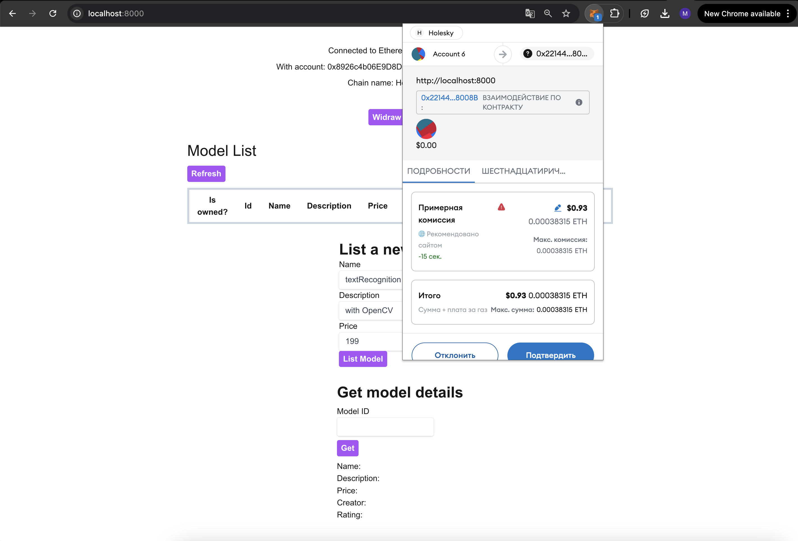

# AI Model Marketplace dApp

## Starting

### 1) Clone the repository

```bash
git clone https://github.com/madinajumaly/AI-dApp.git
cd AI-dApp
```

### 2) Install dependencies for the project

```bash
cd frontend
npm install
```

### 3) Build the project

```bash
npm run build
```

### 4) Start the server

```bash
npm start
```

### Main page



### Listing new model



### Model details


